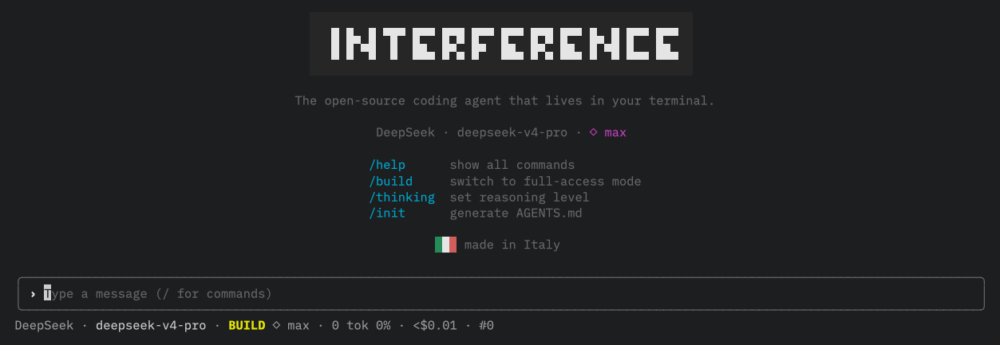

<h1 align="center">interference</h1>

<p align="center"><strong>The open-source coding agent that lives in your terminal.</strong></p>

<p align="center">
  TypeScript + Bun · Plan / Build modes · 11 tools · permissions · sessions with undo · extensible skills · subagents · TUI
</p>

---

**interference** is an AI coding agent for the terminal. You describe a task; it explores your
codebase and edits files or runs commands through an agentic tool-calling loop — with explicit
permissions and a read-only **Plan** mode so nothing happens without your say-so.

> ⚠️ **Requires [Bun](https://bun.sh) 1.3+.** interference runs on the Bun runtime — the CLI
> itself needs Bun installed, whether you install via `bun` or `npm`. Get Bun first:
> `curl -fsSL https://bun.sh/install | bash` (macOS/Linux; see [bun.sh](https://bun.sh) for Windows).

## Behavior is a framework, not a prompt promise

Interference is the first reference host for [Agentic SWE](https://github.com/ricciviero/agentic-swe),
a separate MIT-licensed behavior framework for software-engineering agents. Every primary turn is
evaluated into a typed `BehaviorPlan` before the model receives tools. The framework classifies
intent, opens setup/planning gates, requests scoped capabilities, routes skills, and decides which
hard completion criteria still need evidence.

| Agentic SWE owns | Interference owns |
|---|---|
| Protocol, classification, gates, capability requests, skill routing, evidence and completion policy | Models, concrete tools, Plan/Build mode, permissions, sessions, streaming and terminal UI |

The boundary is deliberate: the prompt explains the current plan, but code enforces it. Effective
access is always the deny-wins intersection of the framework request and Interference's host policy.
Other agent products can adopt Agentic SWE without adopting Interference's tool stack or UI.

For an Interference user this integration is transparent: install only `interference-agent`. Its
release manifest pins `@agenticswe/core`, `@agenticswe/node`, and `@agenticswe/skills`, so Bun or npm
downloads them automatically as runtime dependencies. Agentic SWE runs inside the same Bun process
before Interference exposes tools; there is no second CLI to start, account to create, or service to
configure. `@agenticswe/cli` remains a framework maintainer/integrator tool and is not required to
use Interference.

## Features

- **Agentic SWE behavior core** — open protocol + typed runtime for classification, gates, scoped capabilities, skill routing, evidence-backed completion, and resumable behavior state
- **11 tools**: `read` · `ls` · `glob` · `grep` · `webfetch` · `write` · `edit` · `bash` · `todowrite` · `question` · `task` (subagent)
- **Plan & Build** modes — explore read-only, switch to full access when ready
- **Permissioned by design** — allow / ask / deny enforced in code, not in the prompt; dangerous commands auto-blocked (`rm -rf`, `sudo`, `curl | sh`)
- **Extensible skills** — Agent Skills format (SKILL.md); auto-detected by keyword matching, or invoked via `/skill-name`; 3 skills bundled, user-extensible
- **Subagents** — delegate complex tasks to isolated agents (`explore` read-only, `general` full access, `review` for bug/security/simplicity findings); custom agents definable in `interference.json`; invoke several in the same turn to run them in parallel
- **Atomic edit** — unique-match string replacement with `replaceAll` support
- **Safe bash** — timeout, output truncation, exit code, dangerous-command deny list
- **Session persistence** — messages saved per-project, resume with `--continue`; `/sessions` picker
- **Undo / redo** — file snapshots before every mutation; `/undo` `/redo`
- **Slash commands** — `/help` `/clear` `/init` `/model` `/plan` `/build` `/undo` `/redo` `/compact` `/sessions` `/rename` `/provider` `/thinking` `/review` `/behavior`
- **`@`-file mentions** — type `@` to fuzzy-pick a project file (Tab/Enter inserts its path)
- **Living project memory** — the agent records durable facts about your project in `.agents/memory/` and reloads them every session, so it remembers what isn't in the code (`/init` sets it up, `/remember`/`/memory` manage it)
- **Keyboard shortcuts** — `Esc` interrupts the current turn (keeps the work done so far), `Shift+Tab` cycles Plan/Build, `Ctrl+T` toggles the todo list, `Ctrl+O` collapses/expands tool output, `Ctrl+R` reverse-searches prompt history
- **`/init`** — analyzes your project and generates `AGENTS.md`
- **`/provider`** — manage API keys interactively (stored in `~/.interference/auth.json`)
- **Skill invocation** — explicit `/skill-name` + automatic keyword matching on description
- **Context compaction** — auto-summarizes conversation at ~90% context limit
- **Config file** — per-project `interference.json` (model, permissions, mode, instructions, Agentic SWE enforcement/diagnostics)
- **Diff view** — color-coded (+/-, green/red) in TUI for every edit/write
- **TUI with Ink** — `<Static>` history, streaming, spinner, TextInput, status footer (model / mode / context% / cost / git branch), pickers (model, provider, thinking), slash autocomplete, session list, toast, welcome screen, aligned markdown tables, reverse search over prompt history
- **Multi-provider** — DeepSeek, OpenAI (GPT-5.6 Sol/Terra/Luna), Anthropic (Claude), Zhipu (GLM), Moonshot (Kimi), Google (Gemini), Groq, xAI (Grok), Mistral, OpenRouter + any OpenAI-compatible endpoint; model picker grouped by provider with type-to-filter; pricing/context from a live model catalog. **OpenRouter** loads its full live catalog (hundreds of models) from its `/models` endpoint — filter and pick any of them
- **Reasoning/thinking** — distinct `┄ thinking` blocks with model-specific effort levels, enabled at the maximum supported level by default
- **Cost tracking** — real-time cost estimation per model
- **AGENTS.md & CLAUDE.md** — auto-loaded from project tree into system prompt
- **Italian** — made in Italy, MIT licensed, European

## Why

- **Terminal-native** — no editor lock-in, no web UI; just your shell
- **Permissioned by design** — allow / ask / deny enforced in code
- **European / by choice** — Italian, MIT, GDPR-native, no vendor lock-in
- **Radically transparent** — every tool call, reasoning step, and API cost shown live

## Stack

[Bun](https://bun.sh) · TypeScript · [Vercel AI SDK](https://ai-sdk.dev) (`ai` v7) · [zod](https://zod.dev) · [Ink 7.1](https://github.com/vadimdemedes/ink) + React 19.2 (TUI)

## Quickstart

**1. Install [Bun](https://bun.sh) 1.3+** — the runtime interference needs (skip if you already have it):

```bash
curl -fsSL https://bun.sh/install | bash   # macOS / Linux · Windows: see bun.sh
```

**2. Install and run interference:**

```bash
bun install -g interference-agent
interference
```

On first run, use `/provider` to add your API keys. They're saved in `~/.interference/auth.json`.

interference stores its state in `~/.interference/` — sessions, skills, snapshots, and auth.

Agentic SWE is installed transitively with Interference; users do not install it separately.

> `npm i -g interference-agent` works too, but **Bun must still be installed** to run the CLI (the `interference` binary runs on Bun).

## Agentic SWE enforcement details

The default is `agentic-swe` + `authoritative`. For each primary turn:

- the low-cost model classifies both complexity and whether the user actually requested a mutation;
- complex informational requests stay read-only and do not create planning records;
- non-trivial mutating work must satisfy the configured setup/planning gates before code tools appear;
- effective access is the deny-wins intersection of protocol, Plan/Build mode, concrete host tools,
  and permission rules;
- successful tool events establish redacted setup, planning, implementation, documentation, and
  validation evidence; a failed command never satisfies validation;
- a natural stop with missing hard evidence receives at most three protocol nudges. Abort and user
  refusal always stop immediately.

The system prompt renders the current `BehaviorPlan`; it is not the enforcement boundary. `/behavior`
shows protocol/package version, phase, gates, selected skills, evidence, outstanding criteria, and
recent redacted events. The TUI footer shows the short phase as `A:<phase>`.

To compare a turn without applying the plan, opt into shadow enforcement:

```json
{
  "behavior": {
    "engine": "agentic-swe",
    "enforcement": "shadow",
    "diagnostics": true
  }
}
```

Shadow mode compares the plan with the legacy mode, skill names, and capabilities, but cannot
change the prompt, tools, permissions, or answer. Specialized runs inherit already-restricted
parent capabilities and are never classified independently.

For temporary rollback, explicitly select the legacy engine:

```json
{
  "behavior": {
    "engine": "legacy",
    "enforcement": "legacy",
    "diagnostics": false
  }
}
```

Diagnostics contain hashes, reason codes, names, token counts, and estimated classifier cost —
never the request text, system prompt, source content, secrets, or skill bodies. They are stored
locally under `~/.interference/behavior/`, removed with the session, and summarized by `/behavior`.
Session snapshots persist only versioned plans, event projections, and evidence references for
status and audit. A retry reuses behavior state only when both the turn number and hashed request
identity match; a later request, abort, or refusal always starts with fresh evidence.

> Development status: the integration pins the public Agentic SWE `0.1.0` packages and implements
> Protocol `1.1`. A clean registry install and the complete Interference behavior suite are verified;
> publishing Agentic SWE does not itself release a new Interference version.

## Updating

```bash
bun install -g interference-agent@latest   # or: npm i -g interference-agent@latest
```

interference checks npm for new versions and shows a discreet notice when one is available; run `/update` from inside the app to upgrade.

## Contributing

Contributions are welcome. You do not need to be a member of a GitHub team: fork the repository,
make your change in a branch, and open a Pull Request. See [CONTRIBUTING.md](CONTRIBUTING.md) for
the complete workflow.

## Releasing (maintainers)

`main` accepts changes only through a passing Pull Request. Releases are tag-driven, so prepare the
version in a short-lived release branch, merge its PR into `main`, then create the tag from that
merged commit:

```bash
git checkout dev && git pull --ff-only
git checkout -b release/vX.Y.Z
# Update CHANGELOG.md first.
npm --no-git-tag-version version minor  # patch|minor|major; runs the preversion checks
git add package.json CHANGELOG.md
git commit -m "chore: release vX.Y.Z"
git push -u origin release/vX.Y.Z
# Open and merge a PR to main after CI passes.
git checkout main && git pull --ff-only
git tag -a vX.Y.Z -m "vX.Y.Z"
git push origin vX.Y.Z
npm publish                            # maintainer only; complete the OTP prompt
npm view interference-agent version   # verify the public version
```

The tag workflow validates the release and attempts a provenance publish. The manual `npm publish`
step remains the release authority; an npm Automation token in `NPM_TOKEN` is optional. Sync `main`
back into `dev` after the release. See `CHANGELOG.md`.

## Screenshot



*(Capture your terminal with Cmd+Shift+4, save as `assets/screenshot.png`)*

## Landing page

A static landing page lives in [`site/`](site/).

## License

[MIT](LICENSE)
